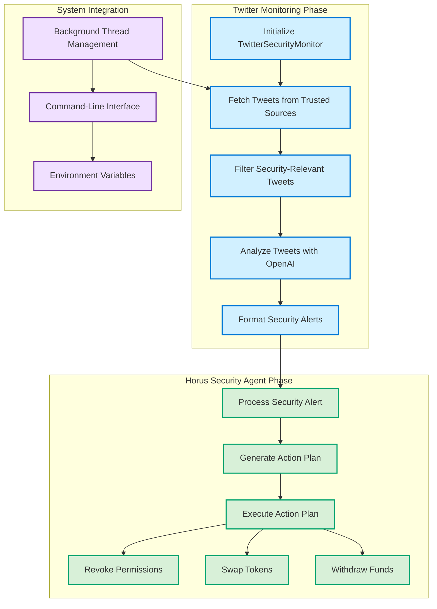

# Twitter Monitoring Process Flow Diagram

## Component Details

### Twitter Monitoring Phase (New)

1. **Initialize TwitterSecurityMonitor**
   - Set up Twitter API client with credentials
   - Initialize OpenAI client
   - Define trusted security accounts
   - Set up tracking for last processed tweet IDs

2. **Fetch Tweets from Trusted Sources**
   - Retrieve latest tweets from each trusted account
   - Track the most recent tweet ID to avoid duplicates
   - Handle API rate limits and network issues

3. **Filter Security-Relevant Tweets**
   - Apply keyword filtering to identify security-related tweets
   - Keywords include: vulnerability, exploit, hack, attack, etc.
   - Reduce the number of tweets for expensive OpenAI analysis

4. **Analyze Tweets with OpenAI**
   - Use GPT-4o to determine if tweets describe real security threats
   - Extract details about the threat, affected systems, and severity
   - Structure the analysis as JSON for easy processing

5. **Format Security Alerts**
   - Create standardized alert messages for each confirmed threat
   - Include all relevant details for the Horus agent to process
   - Add source information and timestamps

### Horus Security Agent Phase (Existing)

6. **Process Security Alert**
   - Analyze the alert to understand the threat
   - Determine the appropriate response strategy
   - Consider the context and severity of the threat

7. **Generate Action Plan**
   - Create a sequence of actions to address the threat
   - Order actions for maximum security effectiveness
   - Include explanations for each action

8. **Execute Action Plan**
   - Perform each action in the optimal sequence
   - Actions may include:
     - Revoking permissions for compromised protocols
     - Swapping vulnerable tokens for safer assets
     - Withdrawing funds to secure addresses

### System Integration

9. **Background Thread Management**
   - Run Twitter monitoring in a separate thread
   - Allow the main application to remain responsive
   - Implement graceful shutdown mechanisms

10. **Command-Line Interface**
    - Provide options to enable/disable Twitter monitoring
    - Allow configuration of check intervals
    - Support both interactive and command-line modes

11. **Environment Variables**
    - Store API credentials securely
    - Load configuration from .env files
    - Validate required variables on startup
